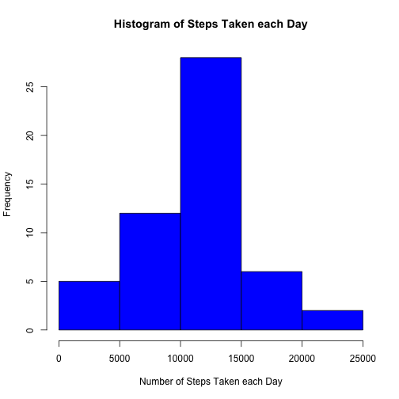
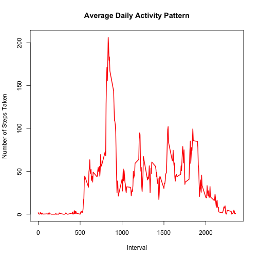
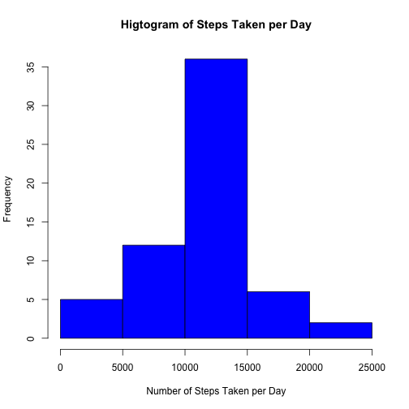
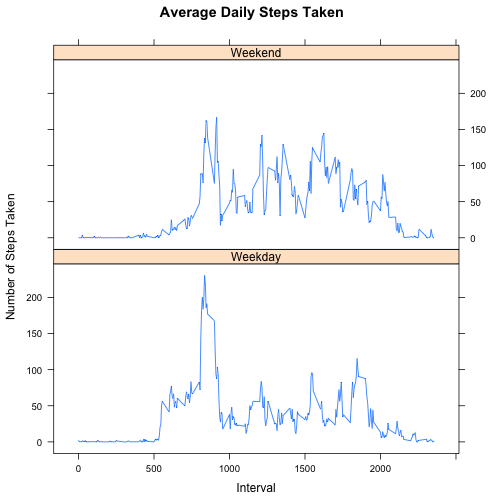

Reproducible Research: Peer Assessment 1
========================================================

# Loading and preprocessing the data

## 1.Load the data

```r
# Read in the dataset
data = read.csv("activity.csv")

# First, let us check the data
str(data)
```

```
## 'data.frame':	17568 obs. of  3 variables:
##  $ steps   : int  NA NA NA NA NA NA NA NA NA NA ...
##  $ date    : Factor w/ 61 levels "2012-10-01","2012-10-02",..: 1 1 1 1 1 1 1 1 1 1 ...
##  $ interval: int  0 5 10 15 20 25 30 35 40 45 ...
```

## 2.Process the data

```r
# Change the date to Date type
data$date = as.Date(data$date, format = "%Y-%m-%d")

# Let's examin what we've done to the data
str(data)
```

```
## 'data.frame':	17568 obs. of  3 variables:
##  $ steps   : int  NA NA NA NA NA NA NA NA NA NA ...
##  $ date    : Date, format: "2012-10-01" "2012-10-01" ...
##  $ interval: int  0 5 10 15 20 25 30 35 40 45 ...
```


# What is mean total number of steps per day?

## 1.Make a histogram of the total number of steps taken each day

```r
# Use the aggregate function to aggregate the data by date.

dailySteps = aggregate(data$steps, by = list(data$date), sum)
colnames(dailySteps) = c("date", "steps")

# Plot the histgram
hist(dailySteps$steps, xlab = "Number of Steps Taken each Day", 
     ylab = "Frequency", main = "Histogram of Steps Taken each Day", col = "blue")
```

 

# 2.Calculate and report the mean and median total number of steps taken per day

```r
meanSteps = mean(dailySteps$steps, na.rm = T)
meanSteps
```

```
## [1] 10766.19
```

```r
medianSteps = median(dailySteps$steps, na.rm = T)
medianSteps
```

```
## [1] 10765
```
### The mean steps taken per day is 10766.19 and the median steps taken per day is 10765.


# What is the average daily activity pattern?

## 1. Make a time series plot of the 5-minute interval the average number of steps taken

```r
# I am going to use aggregate function to calculate the mean steps taken by interval.
intervalSteps = aggregate(data$steps, by = list(data$interval), mean, na.rm = T)
colnames(intervalSteps) = c("interval", "steps")

# plot the time series graph
plot(intervalSteps$interval, intervalSteps$steps, "l", lwd = 2, col = "red",
     xlab = "Interval",ylab = "Number of Steps Taken", main = "Average Daily Activity Pattern")
```

 

## 2. Which 5-minute intervalcontains the maximum number of steps?

```r
maxInterval = intervalSteps[which.max(intervalSteps$steps),]
maxInterval
```

```
##     interval    steps
## 104      835 206.1698
```
### The 835th interval contains the maximum number of steps which is 206.198.


# Imputing missing values

## 1. Calculate and report the total number of missing values in the dataset.

```r
missingValues = sum(is.na(data$steps))
```
### The total number of missing values is 2304.


## 2. Devise a strategy for filling in all of the missing values in the dataset.

### I would use the mean for that 5-minite interval to fill in the missing values

## 3. Create a new dataset that is equal to the original dataset.

```r
# Get the index of the NA values
indexNA = which(is.na(data$steps))

# Calculte the replacing value
replaceNA = rep(0, length(indexNA))
dataNew = data.frame(steps = data$steps, date = data$date, interval = data$interval)
for (i in indexNA){
    interval = dataNew[i,]$interval
    dataNew$steps[i] = intervalSteps[intervalSteps$interval == interval,]$steps
}
# Look at what we've done to the dataNew
str(dataNew)
```

```
## 'data.frame':	17568 obs. of  3 variables:
##  $ steps   : num  1.717 0.3396 0.1321 0.1509 0.0755 ...
##  $ date    : Date, format: "2012-10-01" "2012-10-01" ...
##  $ interval: int  0 5 10 15 20 25 30 35 40 45 ...
```

## 4. Make a histogram of the total number of steps taken each day 

```r
# aggregate the data by date
dailyStepsNew = aggregate(dataNew$steps, by = list(dataNew$date), sum)
colnames(dailyStepsNew) = c("date", "steps")

# plot the histgram
hist(dailyStepsNew$steps, col = "blue", xlab = "Number of Steps Taken per Day",
     ylab = "Frequency", main = "Higtogram of Steps Taken per Day")
```

 

```r
meanStepsNew = mean(dailyStepsNew$steps)
meanStepsNew
```

```
## [1] 10766.19
```

```r
medianStepsNew = median(dailyStepsNew$steps)
medianStepsNew
```

```
## [1] 10766.19
```
### The mean is unchcanged which the median is changed from 10765 to 10766.19.


# Are there differences in activity patterns between weekdays and weekends?

## 1.Use the dataset with the filled-in missing values for this part.

## 2.Create a new factor variable in the dataset with two levels – “weekday” and “weekend”.

```r
# Creare the factor variable
day = weekdays(dataNew$date)
dayLevel = vector()
for (i in 1:nrow(dataNew)){
    if (day[i] == "Saturday" | day[i] == "Sunday"){
        dayLevel[i] = "Weekend"
    }
    else{
        dayLevel[i] = "Weekday"
    }
}
dataNew$dayLevel = dayLevel
dataNew$dayLevel = as.factor(dataNew$dayLevel)
```

## 3.Make a panel plot containing a time series plot of the 5-minute interval.

```r
library(lattice)
# aggregate the data by dayLevel and interval
dailyStepsLevel = aggregate(dataNew$steps, by = list(dataNew$dayLevel, dataNew$interval), mean)
colnames(dailyStepsLevel) = c("dayLevel", "interval", "steps")

# plot the graph
xyplot(steps~interval | dayLevel, dailyStepsLevel, type = "l", layout = c(1, 2),
       xlab = "Interval", ylab = "Number of Steps Taken", main = "Average Daily Steps Taken")
```

 

}
dataNew$dayLevel = dayLevel
dataNew$dayLevel = as.factor(dataNew$dayLevel)
# 3.Make a panel plot containing a time series plot of the 5-minute interval
# and the average number of steps taken, averaged across all weekday days or weekend days.
library(lattice)
dailyStepsLevel = aggregate(dataNew$steps, by = list(dataNew$dayLevel, dataNew$interval), mean)
colnames(dailyStepsLevel) = c("dayLevel", "interval", "steps")
xyplot(steps~interval | dayLevel, dailyStepsLevel, type = "l", layout = c(1, 2),
       xlab = "Interval", ylab = "Number of Steps Taken", main = "Average Daily Steps Taken")

